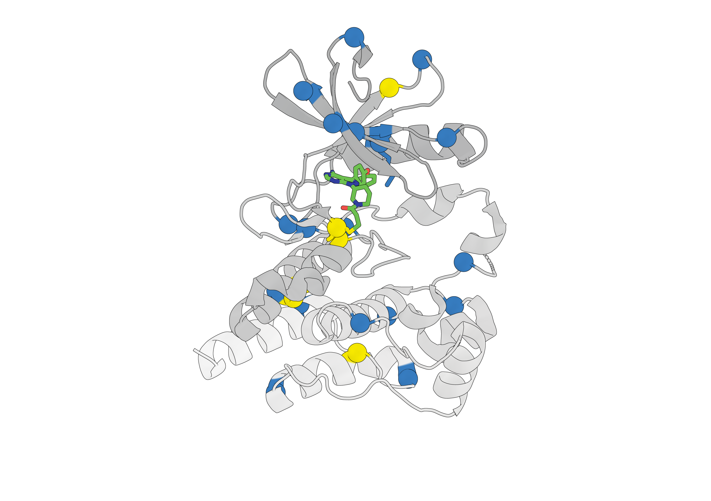
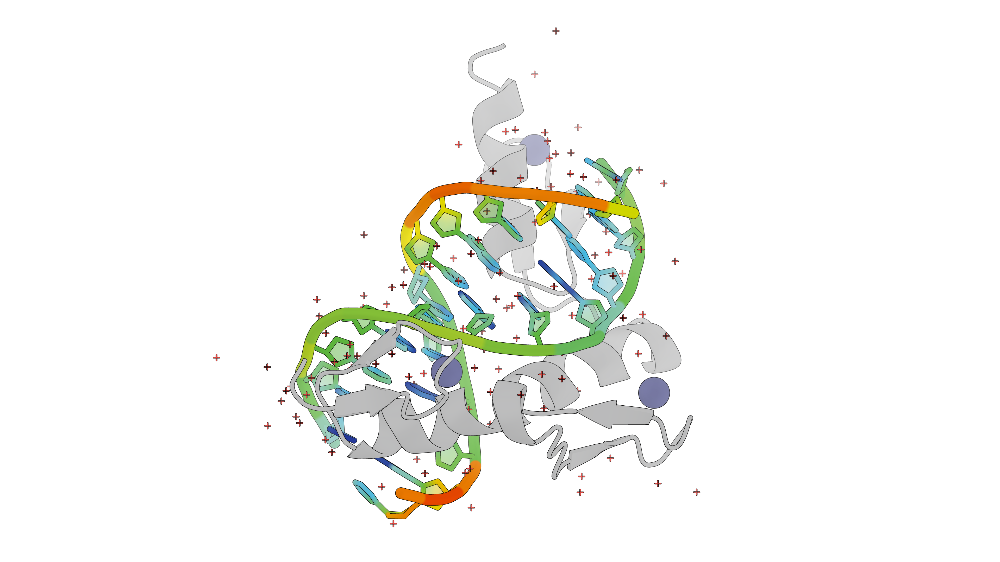
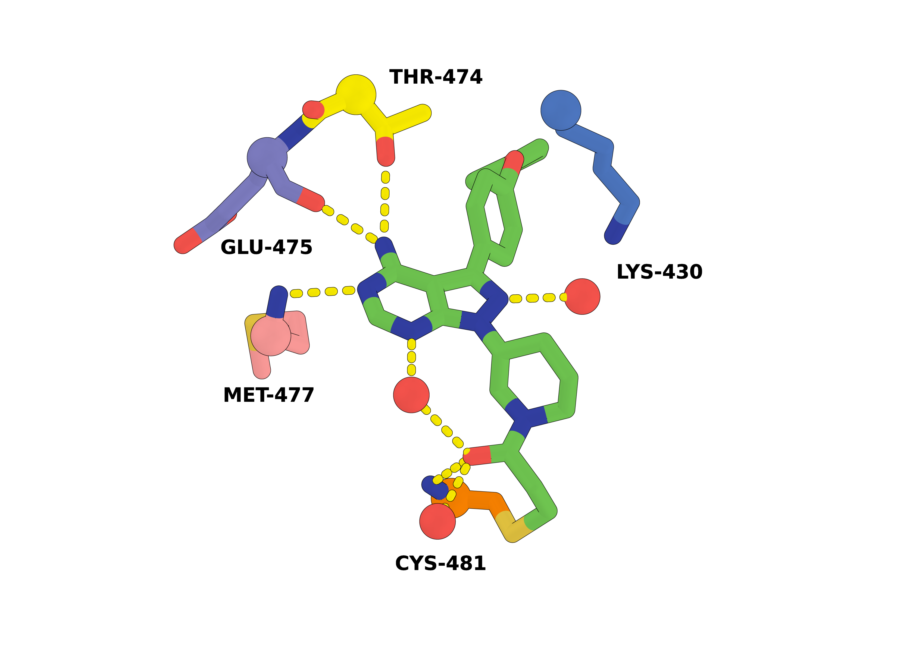
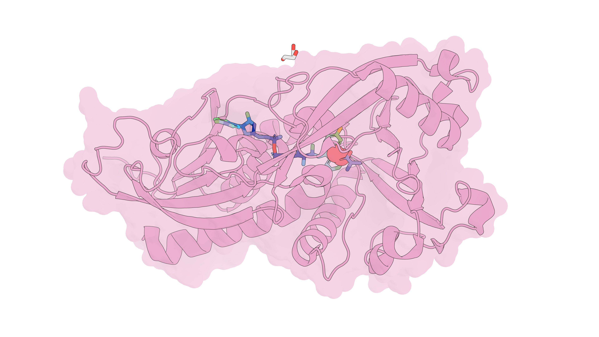

# PyMOLScripts

My PyMOL scripts

## Usage

To use these scripts, you can simply copy `configs/.pymolrc` and `configs/.pymolrc.py` to your home directory which will be loaded automatically by PyMOL.

You may also view and edit these rc files in `PyMOL -> File -> Edit pymolrc`.

## Demo

### Cartoon Representation

### DNA Structure

### Sticks Representation

### Surface Representation

